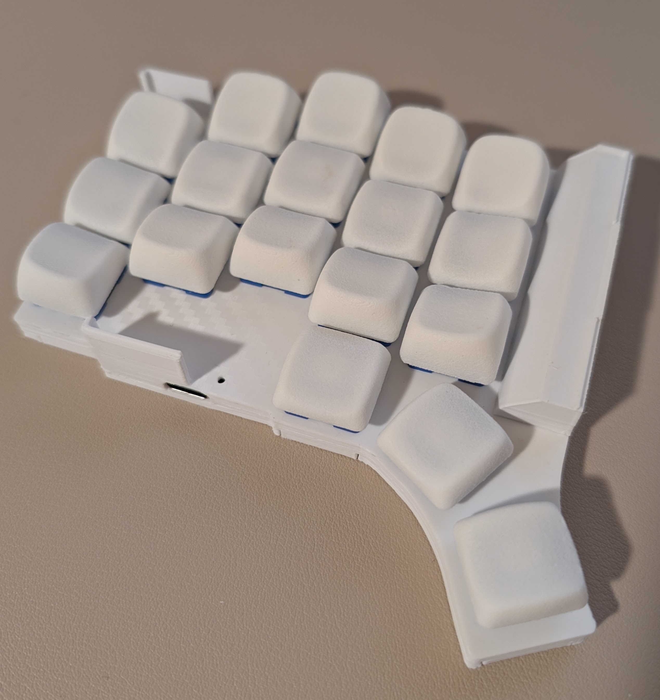
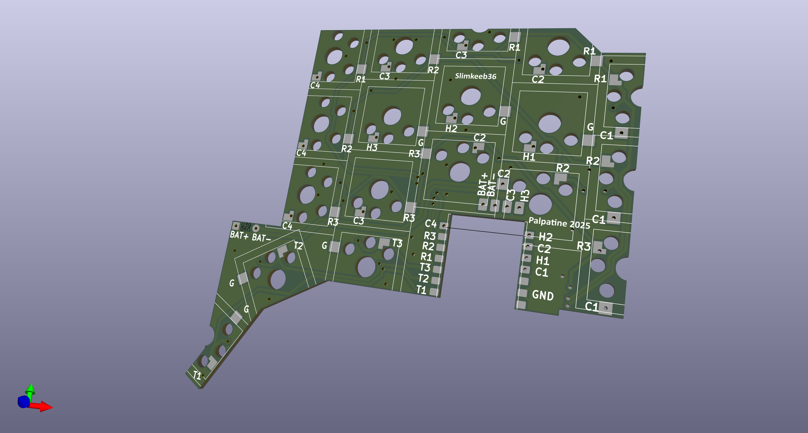

# Slimkeeb 36 wireless split ergo keyboard

This repo contains the PCB design files and the 3d printed case file for the keyboard.
You can find the firmware at [repo](https://github.com/Palpatineli/slimkeeb36-firmware).
In the release page you can find the pre-compiled gerber file, the stl model file and the configured 3mf file.
For the keycap used in the above photo, I am using [CLP](https://github.com/vvhg1/clp-keycaps) which is similar to chicago steno.
However you can use any low profile mx keycap you like.

## Why

Compared to existing ergo keyboards, Slimkeeb36 can be a portable, beginner friendly, and cheap choice:

1. Portable. Slim 36-key wireless design, has a built-in travel mode with no need for cases.
2. Easy to assemble and repair. Diodeless. All parts on one side of pcb.
3. Long battery life
    - Seeed xiao + 10440 battery provides long battery life at low cost
4. More column stagger and protruding thumb cluster for extra ergonomics. Choc V2 switches offer more smooth options compared to choc V1.
5. Cheap for its features:
    - Minimal parts requirement. No diodes, no buttons, no screws or insets.
    - Double sided pcb, under 100x100mm, no castellation. Can be ordered on jlcpcb for <$3 per batch (excluding shipping and tariff).
    - Case can be easily printed at home.

## How

1. Download the gerber file or export from kicad files.
Make you PCB with online PCB vendors, such as [pcbway](https://www.pcbway.com/) or [jlcpcb](https://jlcpcb.com/).
The same PCB design works for both left and right halves.
2. Order the following:
    - Your switches and keycaps.
    - 10440 battery X2 (not AAA! 10440 are 3.7V rechargeable batteries in the same form factor as AAA). I am using [these ones](https://www.amazon.com/Rechargeable-Battery-JESSPOW-Batteries-Flashlight/dp/B08H4RC1Y5).
    - Choc hotswap sockets X36, [such as](https://www.amazon.com/Mechkeeb-Kailh-Low-Hot-swappable-Socket/dp/B0BS3JYJJQ). It's the same one for choc v1 and v2.
    - Seeed Xiao nrf52840 X2, [such as](https://www.amazon.com/XIAO-nRF52840-3PCS-Pack-CircuitPython/dp/B0DJ6NZVJT). Make sure it's nrf52840 or BLE, not BLE sense or BLE plus. Do not buy the pre-soldered ones.
    - Some 24AWG stranded wire.
    - Some electric tape.
3. Tools you will need:
    - Soldering iron
    - Multimeter
    - Soldering wire or paste. Paste is probably easier for beginners. Use the small tip on the iron if you use paste.
    - Toothpicks or small tip tweezers
    - Scissors
    - USB data cable
    - A basic FDM 3d printer, 0.4mm or 0.2mm nozzle. Either PLA or PETG can work.
        - If you don't have a printer that's fine. You can order the print from online vendors (the PCB vendors do 3d prints too).

