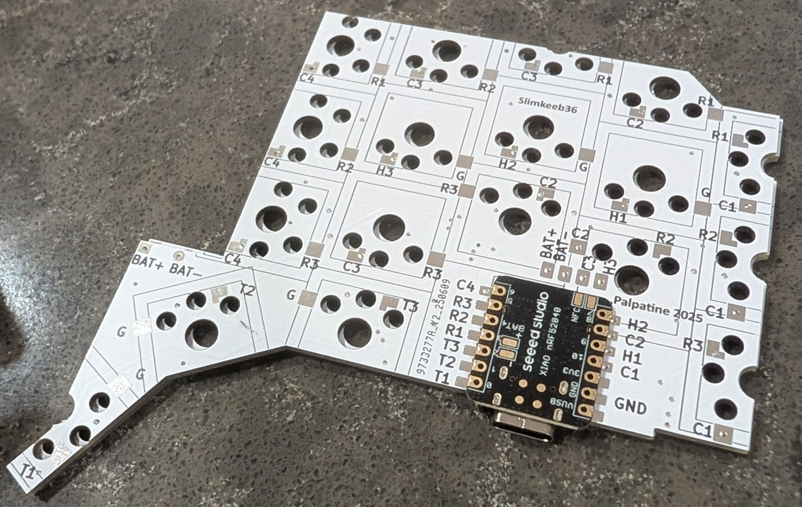

# Slimkeeb 36 wireless split ergo keyboard

This repo contains the PCB design files and the 3d printed case file for the keyboard.
You can find the firmware at [repo](https://github.com/Palpatineli/slimkeeb36-firmware).
In the [release page](https://github.com/Palpatineli/slimkeeb36/releases/latest) you can find the pre-compiled gerber file, the stl model file and the configured 3mf file.
For the keycap used in the above photo, I am using [CLP](https://github.com/vvhg1/clp-keycaps) which is similar to chicago steno.
However you can use any low profile mx keycap you like.

## Why

Compared to existing ergo keyboards, Slimkeeb36 can be a portable, beginner friendly, and cheap choice:

1. Portable. Slim 36-key wireless design, has a built-in travel mode with no need for cases.
2. Easy to assemble and repair. Diodeless. All parts on one side of pcb.
3. Long battery life
    - Seeed xiao + 10440 battery provides long battery life at low cost
4. More column stagger and protruding thumb cluster for extra ergonomics. Choc V2 switches offer more smooth options compared to choc V1.
5. Cheap for its features:
    - Minimal parts requirement. No diodes, no buttons, no screws or insets.
    - Double sided pcb, under 100x100mm, no castellation. Can be ordered on jlcpcb for <$3 per batch (excluding shipping and tariff).
    - Case can be easily printed at home.

## What

1. Download the gerber file or export from kicad files.
Make you PCB with online PCB vendors, such as [pcbway](https://www.pcbway.com/) or [jlcpcb](https://jlcpcb.com/).
The same PCB design works for both left and right halves.
Follow vendor's guide on gerber export [such as](https://www.pcbway.com/helpcenter/generate_gerber/Generate_Gerber_file_from_Kicad.html), since the format requirement can be different.
2. Order the following:
    - Your switches and keycaps.
    - 10440 battery X2 (not AAA! 10440 are 3.7V rechargeable batteries in the same form factor as AAA). I am using [these ones](https://www.amazon.com/Rechargeable-Battery-JESSPOW-Batteries-Flashlight/dp/B08H4RC1Y5).
    - Choc hotswap sockets X36, [such as](https://www.amazon.com/Mechkeeb-Kailh-Low-Hot-swappable-Socket/dp/B0BS3JYJJQ). It's the same one for choc v1 and v2.
    - Seeed Xiao nrf52840 X2, [such as](https://www.amazon.com/XIAO-nRF52840-3PCS-Pack-CircuitPython/dp/B0DJ6NZVJT). Make sure it's nrf52840 or BLE, not BLE sense or BLE plus. Do not buy the pre-soldered ones.
    - Some 24AWG stranded wire.
    - Some electric tape.
3. Tools you will need:
    - Soldering iron
    - Multimeter
    - Soldering wire or paste. Paste is probably easier for beginners. Use the small tip on the iron if you use paste.
    - Toothpicks or small tip tweezers
    - Scissors
    - Super glue
    - USB data cable
    - A basic FDM 3d printer, 0.4mm or 0.2mm nozzle. Either PLA or PETG can work.
        - If you don't have a printer that's fine. You can order the print from online vendors (the PCB vendors do 3d prints too).

## How

1. Use solder wire or very little paste to solder the seeed xiao on the PCB. If you use too much paste on seeed xiao the pads will short and it's hard to repair.
    
2. Use 4 pieces of wire to connect the 4 pads (battery+, battery-, NFC-1, NFC-2) to the corresponding pads on the PCB board.
3. Solder 2 pieces of wires to the innermost battery+ and battery- pads. Leave bare ends for battery. For best contact, leave a lot of bare end and roll it into a ball.
4. Solder the hotswaps. The easy way to solder them is simply to use a lot paste, but I should clean it up afterwards.
5. Use electric tapes to bind the battery+ and battery- bare wire ends to the battery.
    - If connected correctly, when you plugin the USB cable to seeed xiao, the green light will light up.
6. Test your board with a multimeter. Then flash the seeed xiao's, connect wirelessly to your computer, and test the keys now either by temporarily plugging in the switches, or just use barewire/tweezers.
7. Print your case.
    - You can just use the 3mf file for printing. It's set up for 0.2 nozzle, pla, high temp smooth 180mm plate.
    - Or you can use the stl files.
        - The 'top' parts needs to be cut at 6.4mm, then its bottom half flipped. The bottom half needs to have 100% infill and [bricklayer](https://github.com/TengerTechnologies/Bricklayers).
    - You can modify and run the `.py` file to get the stl file. Uncomment the last part if you need `.step` file for use in other modeling software. The only dependency is the `build123d` package.
        - You can reduce the h['key'] if you only plan to use flat keycaps.
8. Assembly:
    1. Check the switch openings. Sometimes the first layer is overextruded and you need to trim it down or the switches will not fit.
    2. Use super glue to attach battery compartment and shroud to the top cover.
    3. Carefully insert the battery into the grove, with the attached wire on the deeper side.
    4. Aim to board to the opening on the bottom part. Snap close the case.
    5. Install your switches and keycaps.

